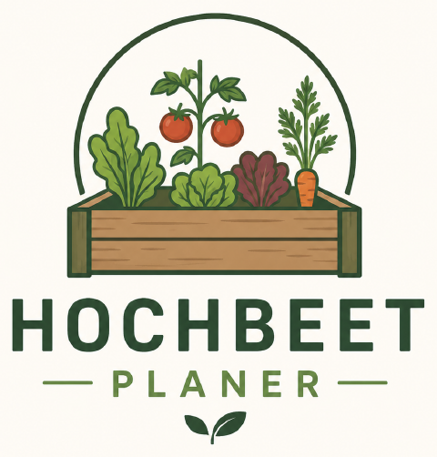

# Hochbeet-Planer

Ein Hochbeet maßstabsgetreu planen, gute Nachbarn finden und die Pflege
automatisch im Griff behalten — auf dem Handy, auch ohne Empfang im Garten.



## Was die App kann

**Beet planen.** Die Beetfläche wird in echten Zentimetern gezeichnet. Jede
Pflanze belegt auf dem Bildschirm genau die Fläche, die sie im Beet
beansprucht — nichts wird für die Bedienbarkeit größer gezeichnet, als es ist,
also sieht man sofort, ob noch etwas dazwischenpasst. Eng gesäte Kulturen wie
Karotten erscheinen als dichtes Feld kleiner Punkte; die Legende unter dem Beet
sagt, was da wächst. Auf dem Handy: antippen zum Setzen, antippen zum Auswählen,
ziehen zum Verschieben, mit zwei Fingern zoomen.

**Mischkultur prüfen.** Gute und schlechte Nachbarn werden live markiert und
mit Begründung erklärt (Gertrud Franck, Bioland u. a.). Konflikte lassen sich
mit einem Tipp automatisch auflösen.

**Aufgaben bekommen.** Aus der tatsächlichen Bepflanzung entstehen Gieß-,
Aussaat-, Vorzieh-, Ernte- und Pflegetermine — inklusive Eisheiligen-Warnung
für frostempfindliche Kulturen. Sie landen im Kalender und auf dem Startbild.

**Fruchtfolge planen.** Vier Saisons je Beet, Bepflanzung per Tipp in die
nächste Saison übernehmen, Warnung wenn dieselbe Pflanzenfamilie zu oft
zurückkommt, plus Empfehlung nach Stark-/Mittel-/Schwachzehrer.

**Plan generieren.** Der Generator baut eine echte Reihenmischkultur: hohe
Pflanzen nach hinten, keine verfeindeten Nachbarreihen, Reihenabstände nach
den Pflanzabständen. Er packt so viel von deiner Auswahl ins Beet, wie die
Tiefe hergibt — und sagt zu jeder Pflanze, die es nicht hineingeschafft hat,
warum (falsche Saison, zu tief für das Beet, kein Platz mehr). Aus der
Beetansicht heraus startbar, mit dem Beet und der Saison als Vorgabe.

**Ernte protokollieren.** Geplanter gegen tatsächlichen Ertrag je Beet.

**Wetter.** Frost-, Hitze- und Gießhinweise für die konkret gepflanzten Arten
(optional, benötigt einen OpenWeather-Schlüssel).

## Bedienung auf dem Handy

- **Tippen auf die Erde** setzt die gewählte Pflanze. Passt sie nicht, sagt die
  App warum, statt einfach nichts zu tun.
- **Tippen auf eine Pflanze** wählt sie aus und öffnet die Aktionsleiste
  (Anzahl −/+, Info, Entfernen). Ein Fehltipp löscht nichts mehr.
- **Ziehen** verschiebt, **zwei Finger** zoomen, **Doppeltipp** zoomt auf die
  Stelle.
- Jede löschende Aktion lässt sich über die Meldung sofort **rückgängig**
  machen.
- Alle Detailbereiche (Analyse, Pflege, Ernte, Notizen, Einstellungen) sind als
  Bottom-Sheets erreichbar — auf dem Handy gibt es dieselben Funktionen wie am
  Rechner.
- Dunkelmodus, Safe-Area-Unterstützung für Notch und Home-Indicator,
  Touch-Ziele ab 44 px.

## Offline & Installation

Die App ist eine PWA: Sie lässt sich über *Einstellungen → Zum Homescreen
hinzufügen* installieren, startet ohne Browserleiste und funktioniert offline.
Alle Beete liegen lokal im Browser; mit Konto werden sie zusätzlich mit
Firestore synchronisiert.

## Entwicklung

```bash
npm install
npm run dev       # Entwicklungsserver
npm run build     # Produktions-Build nach dist/
npm run preview   # Build lokal ausliefern (Service Worker aktiv)
npm test          # Tests des Plan-Generators
npm run icons     # Logo/Icons aus assets/logo-source.png neu erzeugen
```

Konfiguration über `.env` (siehe `.env.example`). Ohne Firebase-Schlüssel läuft
die App vollständig lokal — das Firebase-SDK wird dann gar nicht erst geladen.

## Aufbau

```
src/
  data/plants.js         Pflanzendaten + Mischkultur-Matrix
  data/plantDetails.js   Aussaat-/Erntemonate, Zehrerklasse, Wurzeltiefe
  lib/beds.js            Beet-Store (localStorage + Firestore-Spiegel)
  lib/tasks.js           Aufgaben-Store
  utils/planGenerator.js Reihenmischkultur-Generator (siehe tests/)
  utils/taskEngine.js    Aufgaben aus der Bepflanzung ableiten
  utils/rotationAdvice.js Fruchtfolge-Analyse
  utils/weatherAdvice.js Wetterhinweise
  hooks/useBed.js        Bearbeitung einer Beet-Saison (Setzen, Verschieben, Undo)
  components/BedCanvas   Zeichenfläche mit Zoom, Auswahl und Kollisionsprüfung
  pages/                 Bildschirme
```

## Datenquellen

Mischkultur- und Anbaudaten nach Gertrud Franck („Mischkulturen im
Gemüsegarten"), Bioland-Anbaurichtlinien, DGG und weiteren deutschsprachigen
gartenbaulichen Veröffentlichungen. Angaben sind Richtwerte für Mitteleuropa
(Zone 6–8).
